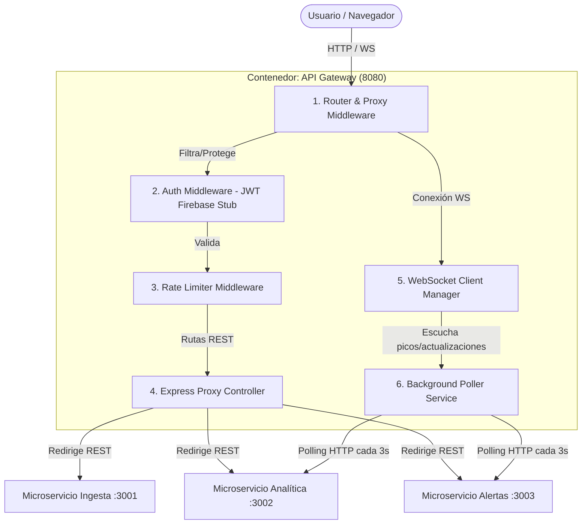
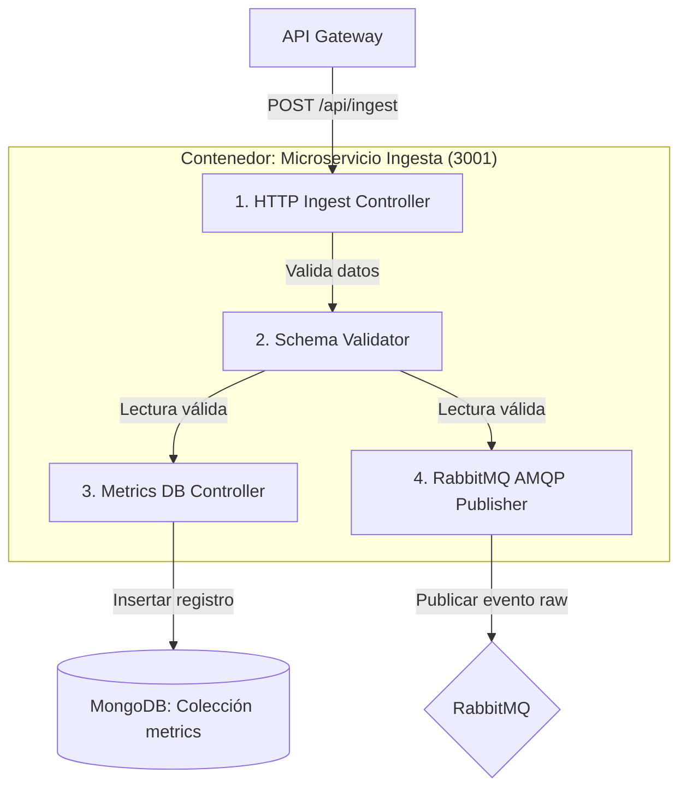
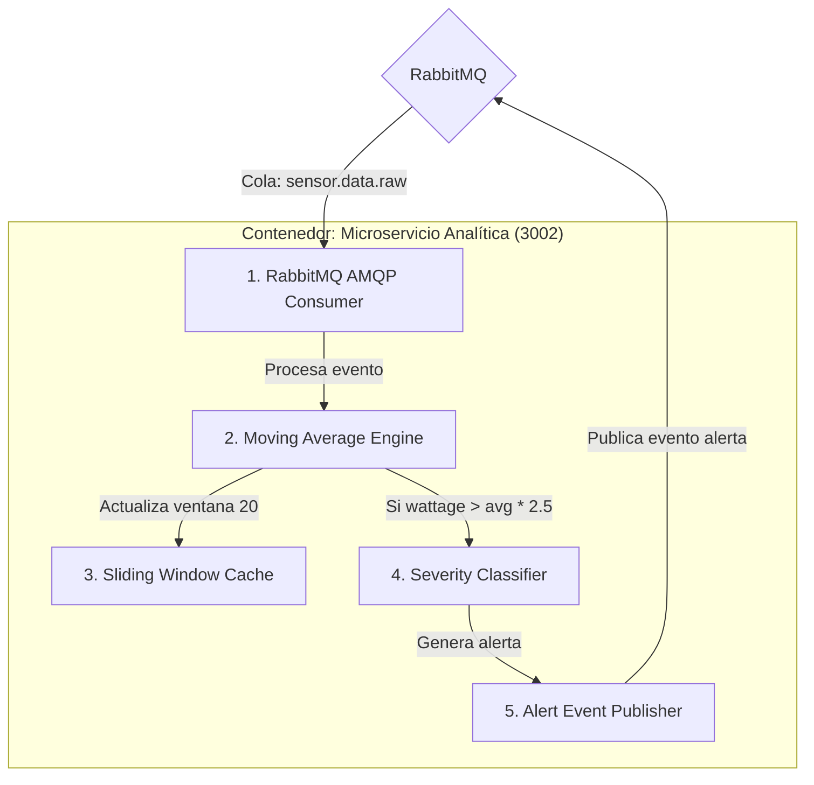
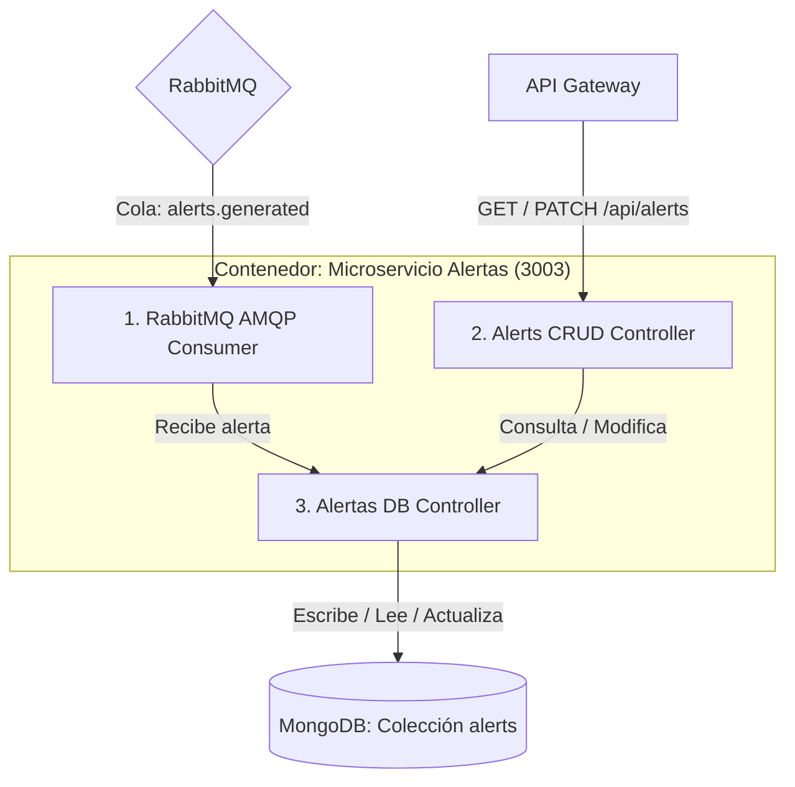
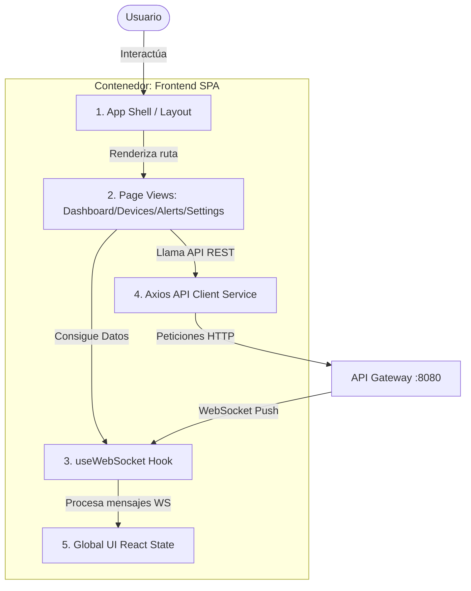

# 🏗️ C4 Model — Nivel 3: Diagramas de Componentes

Este documento detalla la descomposición del sistema **Smart Energy Hub** en su tercer nivel (Componentes), mostrando la estructura interna de los contenedores definidos en el Corte 1.

---

## 1. Componentes del API Gateway

El **API Gateway** actúa como el punto de entrada único de la aplicación. Administra el enrutamiento a los microservicios, la comunicación WebSocket en tiempo real con el cliente y está preparado para centralizar la seguridad.

💻 Ver código fuente Mermaid

### Descripción de Componentes del Gateway
1.  **Router & Proxy Middleware**: Intercepta todas las peticiones entrantes. Clasifica si son conexiones WebSocket (`/ws`) o peticiones REST tradicionales (`/api/*`).
2.  **Auth Middleware (JWT Firebase Stub)**: Intercepta las rutas protegidas. En el Corte 2 valida el token Bearer utilizando el Firebase Admin SDK. Si no hay token o es inválido, aborta la petición con `401 Unauthorized`.
3.  **Rate Limiter Middleware**: Evita el abuso de peticiones mediante límites de tasa (especialmente útil para el simulador o llamadas automatizadas de ingesta).
4.  **Express Proxy Controller**: Redirige dinámicamente las llamadas HTTP correspondientes a los puertos internos de los microservicios sin exponerlos directamente a la red externa.
5.  **WebSocket Client Manager**: Mantiene y gestiona el ciclo de vida de los clientes web conectados al canal en tiempo real para empujar (push) novedades.
6.  **Background Poller Service**: Servicio en segundo plano que consulta de manera periódica las bases de datos de analítica y alertas para transmitir actualizaciones inmediatas a través del *WebSocket Client Manager*.

---

## 2. Componentes del Microservicio de Ingesta

El microservicio de **Ingesta** es el encargado de procesar la entrada masiva de lecturas procedentes de los sensores.

💻 Ver código fuente Mermaid

### Descripción de Componentes de Ingesta
1.  **HTTP Ingest Controller**: Recibe peticiones individuales o en lote (batch) de lecturas de sensores.
2.  **Schema Validator**: Verifica que el cuerpo del JSON cumpla con el formato técnico exigido (que posea `deviceId`, `deviceName`, `wattage`, `voltage`, `current`, `timestamp`).
3.  **Metrics DB Controller**: Abstrae las operaciones de escritura (append-only) para almacenar el historial de métricas energéticas directamente en la base de datos de producción (MongoDB).
4.  **RabbitMQ AMQP Publisher**: Traduce la lectura a un formato de evento y lo publica con confirmación (ACK) en el intercambio del broker de mensajes utilizando la cola `sensor.data.raw`.

---

## 3. Componentes del Microservicio de Analítica

El microservicio de **Analítica** procesa los eventos raw asíncronamente y determina la existencia de picos de consumo utilizando una media móvil.

💻 Ver código fuente Mermaid

### Descripción de Componentes de Analítica
1.  **RabbitMQ AMQP Consumer**: Se suscribe de forma persistente a la cola `sensor.data.raw`, leyendo los eventos de sensores a medida que son publicados por Ingesta.
2.  **Moving Average Engine**: Núcleo algorítmico del servicio. Calcula el promedio del consumo histórico para el dispositivo en cuestión.
3.  **Sliding Window Cache**: Almacenamiento rápido en memoria cache estructurado (ventana deslizante de tamaño 20 por dispositivo) de las últimas lecturas para calcular la media móvil sin consultar la base de datos.
4.  **Severity Classifier**: Clasifica los picos detectados basándose en el ratio `lectura_actual / promedio_movil` en cuatro rangos de severidad: *low, medium, high* y *critical*.
5.  **Alert Event Publisher**: Publica los eventos clasificados de alertas en la cola de RabbitMQ `alerts.generated` para su almacenamiento y consumo del Gateway.

---

## 4. Componentes del Microservicio de Alertas

El microservicio de **Alertas** gestiona la base de datos de alertas generadas y ofrece un servicio CRUD para consultar y modificar su estado de lectura.

💻 Ver código fuente Mermaid

### Descripción de Componentes de Alertas
1.  **RabbitMQ AMQP Consumer**: Se suscribe a `alerts.generated`. Garantiza la recepción y el procesamiento seguro de cada alerta creada por Analítica.
2.  **Alerts CRUD Controller**: Expone las API HTTP internas necesarias para consultar alertas paginadas, contar alertas sin leer y marcar alertas específicas como leídas por el usuario final.
3.  **Alertas DB Controller**: Encapsula las consultas y escrituras a la colección `alerts` de MongoDB (o Firestore) para mantener la persistencia persistente del estado de las alertas.

---

## 5. Componentes del Frontend (React + Vite)

El **Frontend** está organizado como una SPA modularizada donde los componentes interactúan de forma reactiva con los datos en tiempo real.

💻 Ver código fuente Mermaid

### Descripción de Componentes del Frontend
1.  **App Shell / Layout**: Contiene la navegación principal, barra lateral, barra superior y gestiona la estructura visual principal del aplicativo.
2.  **Page Views**: Vistas del cliente:
    *   *Dashboard*: Muestra métricas globales, gráficos en tiempo real con **Recharts** y un resumen analítico.
    *   *Devices*: Lista y detalla el estado actual, históricos y barra de carga de cada dispositivo.
    *   *Alerts*: Centro de visualización de eventos de consumo anómalo con paginación e interacción.
    *   *Settings*: Configuración de variables del simulador y visualizador técnico de la arquitectura.
3.  **useWebSocket Hook**: Hook personalizado de React que abre la conexión con `/ws`, gestiona la reconexión automática en caso de caída y parsea los mensajes entrantes de métricas y alertas.
4.  **Axios API Client Service**: Cliente HTTP centralizado para interactuar con la REST API del Gateway (marcar alertas, traer históricos, etc.).
5.  **Global UI React State**: Estado reactivo global que almacena el buffer de métricas del dashboard en tiempo real y desencadena notificaciones flotantes (toasts) cuando llega una nueva alerta crítica.
