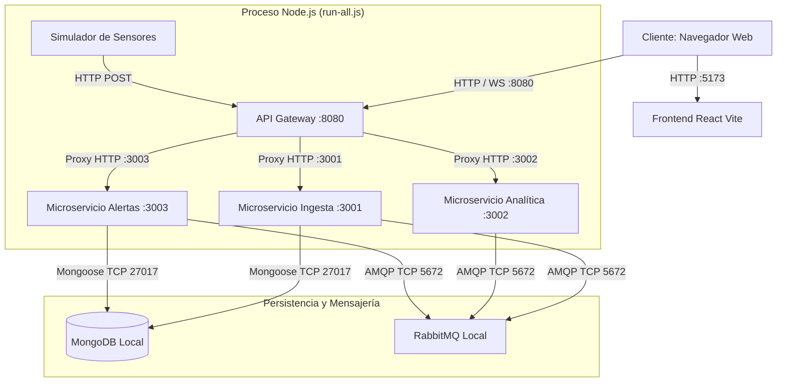
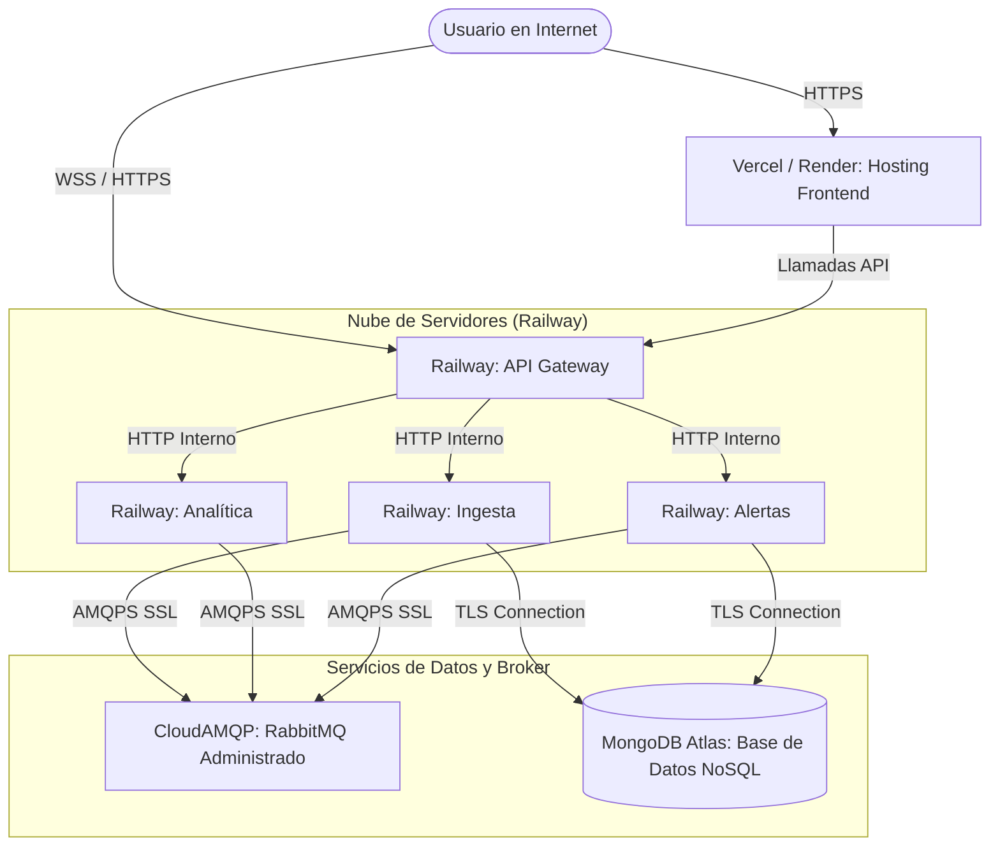

# 🚀 Arquitectura de Despliegue y Distribución — Corte 2

Este documento describe la topología física, el mapeo de puertos y la estrategia de despliegue en producción para **Smart Energy Hub**. Siguiendo las directrices del equipo, se define tanto el esquema de despliegue local normal (sin contenedores) como el esquema de producción en la nube (Multinube de bajo costo).

---

## 1. Topología Física Local (Modo Desarrollo Normal)

En el entorno local de desarrollo, el sistema se despliega mapeando puertos individuales en `localhost`. Las dependencias externas (Base de Datos NoSQL y Message Broker) pueden correr localmente o ser emuladas en memoria (modo integrado de `run-all.js`).

💻 Ver código fuente Mermaid

### Tabla de Puertos del Sistema Local

| Servicio | Puerto Local | Tecnología | Tipo de Entrada / Salida |
|----------|--------------|------------|---------------------------|
| **Frontend Web** | `5173` | Vite Dev Server | HTTP (salida al usuario) |
| **API Gateway** | `8080` | Express + WebSocket | HTTP + WS (puerto expuesto único) |
| **MS Ingesta** | `3001` | Express / Node.js | HTTP (privado / proxy) |
| **MS Analítica** | `3002` | Express / Node.js | HTTP (privado / proxy) |
| **MS Alertas** | `3003` | Express / Node.js | HTTP (privado / proxy) |
| **RabbitMQ Broker** | `5672` (AMQP) / `15672` (Admin) | Erlang / RabbitMQ | TCP / HTTP (consola de administración) |
| **MongoDB** | `27017` | NoSQL Database | TCP (persistencia) |

---

## 2. Topología de Despliegue en Producción (Cloud Híbrido / Multinube)

Para llevar el proyecto a producción con alta disponibilidad y bajo costo, se propone un despliegue distribuido utilizando plataformas modernas basadas en la nube:

💻 Ver código fuente Mermaid

### Proveedores Cloud Seleccionados
1.  **Frontend (Vercel o Render - Capa Gratuita)**:
    *   Hospeda la aplicación de React optimizada para producción (build estático).
    *   Soporta HTTPS de forma nativa.
2.  **Microservicios y Gateway (Railway - PaaS)**:
    *   Excelente para desplegar aplicaciones Node.js de forma directa desde GitHub mediante CI/CD automático.
    *   Permite interconexión de red interna privada, lo que significa que los puertos `3001`, `3002` y `3003` solo son accesibles internamente por el API Gateway (puerto `8080`), protegiendo el backend de accesos maliciosos directos.
3.  **RabbitMQ (CloudAMQP - Plan Little Lemur gratis)**:
    *   Instancia en la nube de RabbitMQ totalmente administrada.
    *   Soporta colas seguras vía SSL/TLS (`amqps`).
4.  **Base de Datos (MongoDB Atlas - M0 Free Tier)**:
    *   Base de datos relacional NoSQL en la nube con escalabilidad automática.
    *   Cuenta con copias de seguridad automáticas y protección de red por lista blanca de IPs.

---

## 3. Guía de Ejecución Local en "Modo Integrado"

Si no cuentas con Docker instalado o quieres realizar una prueba rápida sin configurar instancias de RabbitMQ y MongoDB locales, el sistema incluye el archivo de conveniencia [run-all.js](file:///c:/Users/HAYDER/Pictures/proyecto de arqui/Proyecto_Arquitectura/smart-energy-hub/run-all.js).

### Cómo Arrancar Todo en 2 Pasos:

1.  **Instalar dependencias e iniciar el Backend + Simulador:**
    Usa el lanzador automático creado en el Corte 2:
    *   Haz doble clic en **`iniciar_servicios.bat`**.
    *   *Detrás de escena:* Esto ejecutará `node run-all.js` que levanta la Ingesta, Analítica, Alertas, API Gateway y el Simulador interconectados en memoria usando un bus de eventos global.

2.  **Interactuar con el Sistema:**
    *   Abre tu navegador en http://localhost:5173 para ingresar al panel de control del Smart Energy Hub.
    *   Puedes verificar el flujo en tiempo real en la consola de comandos de tu sistema.
