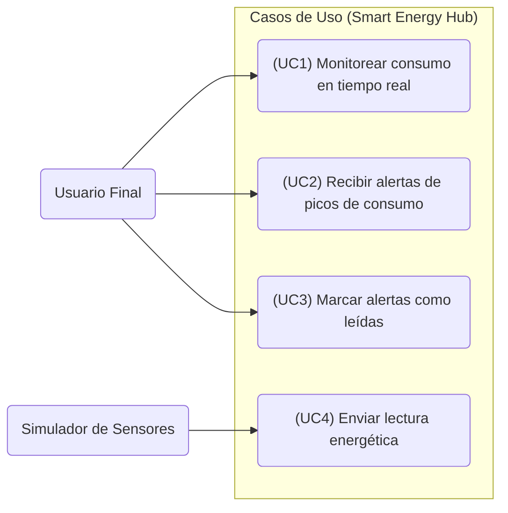
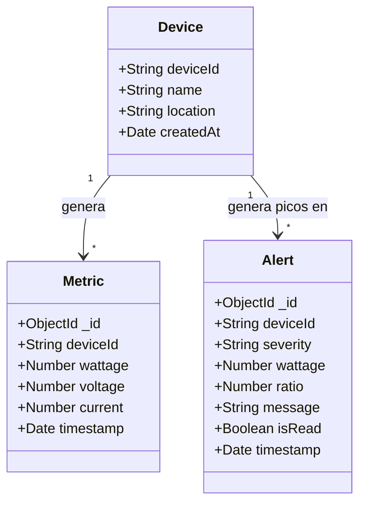
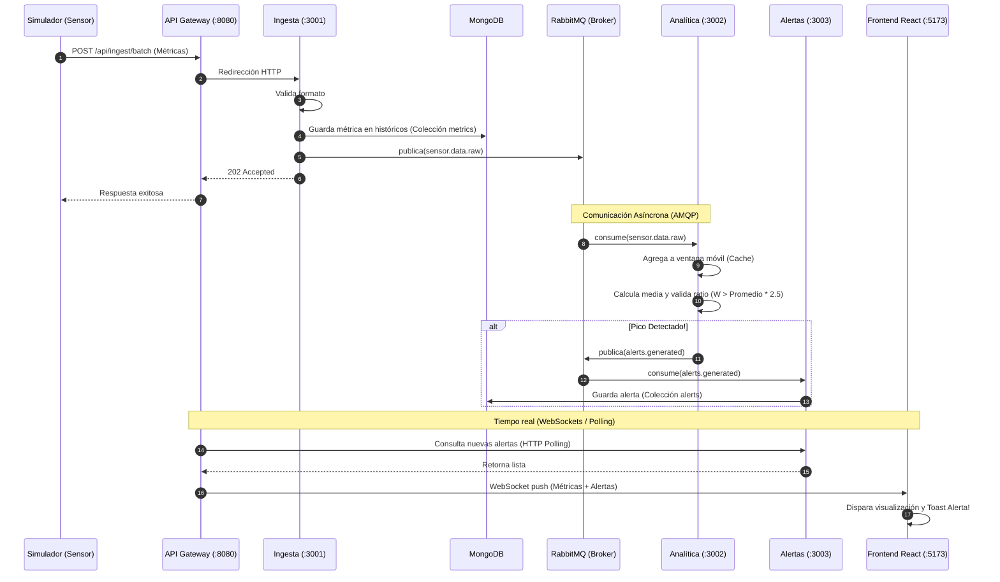
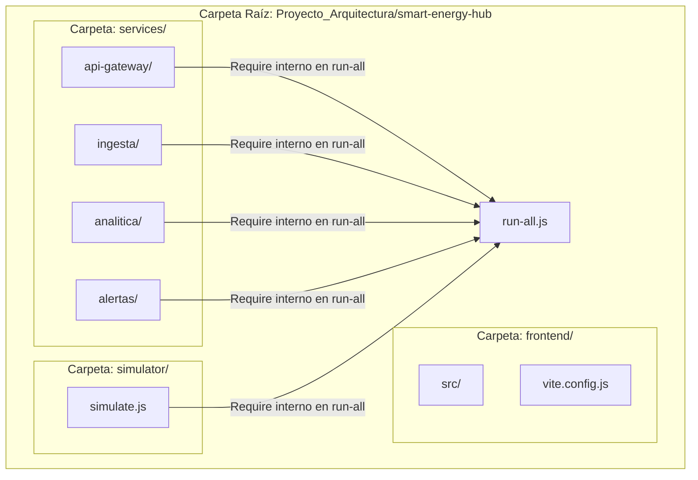
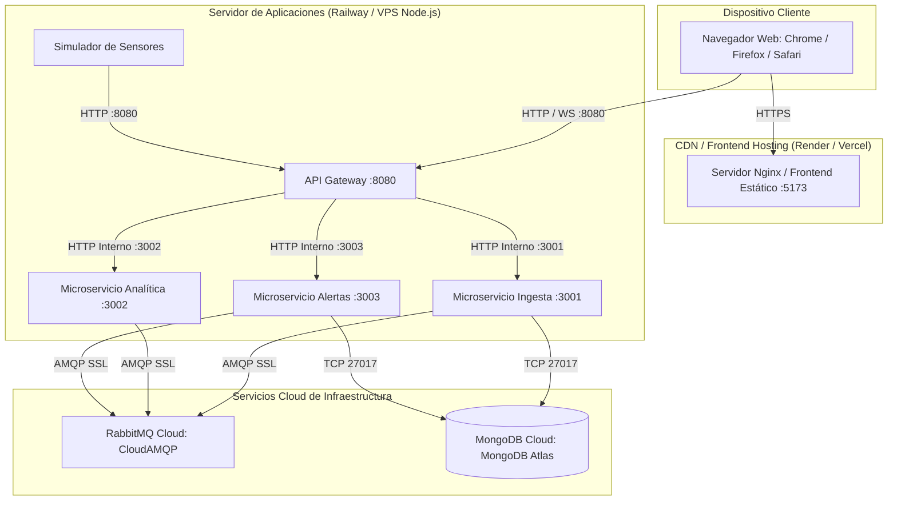

# 🏛️ Modelo de Vistas 4+1 — Smart Energy Hub

Este documento describe la arquitectura del sistema **Smart Energy Hub** utilizando el **Modelo de Vistas 4+1** de Kruchten. Este marco permite representar el diseño de software desde diferentes perspectivas para satisfacer a los distintos *stakeholders* (desarrolladores, administradores de sistemas, ingenieros de QA y clientes).

---

## 🚀 Vista de Escenarios (El "+1")

La vista de escenarios une a las otras cuatro perspectivas mediante los casos de uso críticos del sistema.

### Caso de Uso 1: Monitoreo en Tiempo Real (Telemetría de Sensores)
*   **Actores**: Simulador de Sensores (Productor), Usuario Web (Visualizador).
*   **Flujo**: El simulador envía datos energéticos continuos; el sistema ingesta, registra, publica y empuja estos datos mediante WebSockets al dashboard web en menos de 2 segundos.

### Caso de Uso 2: Detección y Gestión de Alertas de Pico
*   **Actores**: Microservicio de Analítica (Analizador), Microservicio de Alertas (Gestor), Usuario Web.
*   **Flujo**: Se detecta un pico de consumo. Analítica genera un evento de alerta, Alertas lo persiste e inmediatamente el usuario recibe una notificación emergente en su pantalla que puede marcar como "leída".

💻 Ver código fuente Mermaid

---

## 🧩 1. Vista Lógica

La Vista Lógica se centra en los requisitos funcionales del sistema, mostrando las abstracciones de datos y el modelo de dominio.

### Esquemas de Datos (MongoDB)

💻 Ver código fuente Mermaid

---

## ⚙️ 2. Vista de Procesos

La Vista de Procesos explica el comportamiento dinámico del sistema en tiempo de ejecución, abordando la concurrencia, sincronización de hilos y flujo de datos.

### Diagrama de Secuencia: Ingesta de Telemetría y Detección Asíncrona de Picos

💻 Ver código fuente Mermaid

---

## 📦 3. Vista de Desarrollo (Implementación)

La Vista de Desarrollo describe cómo está estructurado el código fuente en carpetas y la gestión de paquetes del proyecto.

### Estructura de Módulos (Monorepo del Proyecto)

💻 Ver código fuente Mermaid

### Relación de Dependencias del Proyecto (NPM)
*   **api-gateway**: `express`, `ws`, `cors`, `http-proxy-middleware`.
*   **ingesta**: `express`, `mongoose`, `amqplib` (RabbitMQ), `cors`.
*   **analitica**: `express`, `amqplib`, `cors`.
*   **alertas**: `express`, `mongoose`, `amqplib`, `cors`.
*   **frontend**: `react`, `react-dom`, `recharts` (gráficos), `lucide-react` (iconos), `axios` (HTTP), `vite` (bundler).
*   **simulator**: `axios`.

---

## 🖥️ 4. Vista Física (Despliegue)

La Vista Física describe la topología de red, el hardware y la distribución física de los componentes ejecutándose en los servidores de producción.

### Topología de Despliegue en Producción (Cloud Híbrido)

💻 Ver código fuente Mermaid

